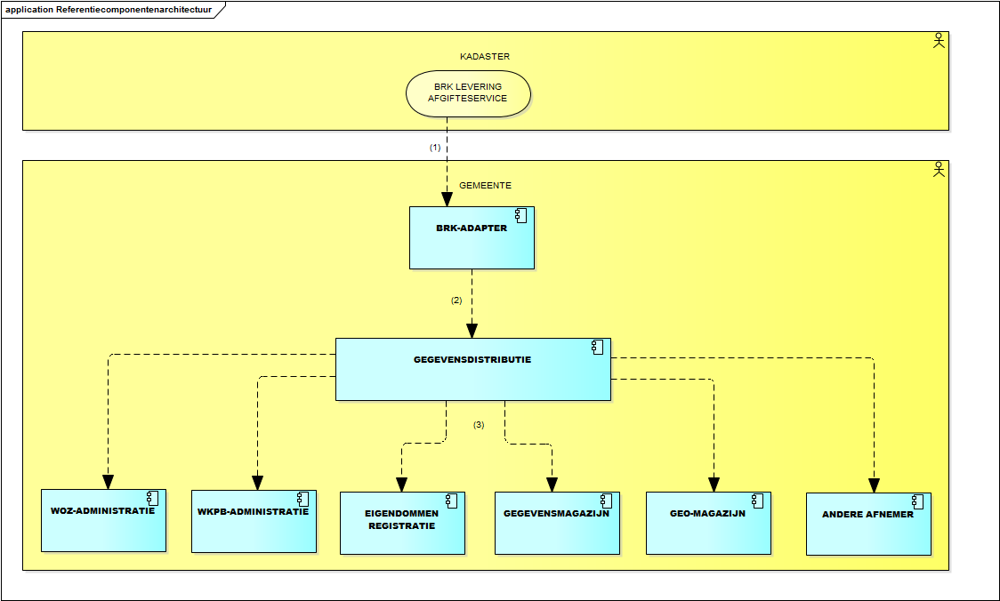
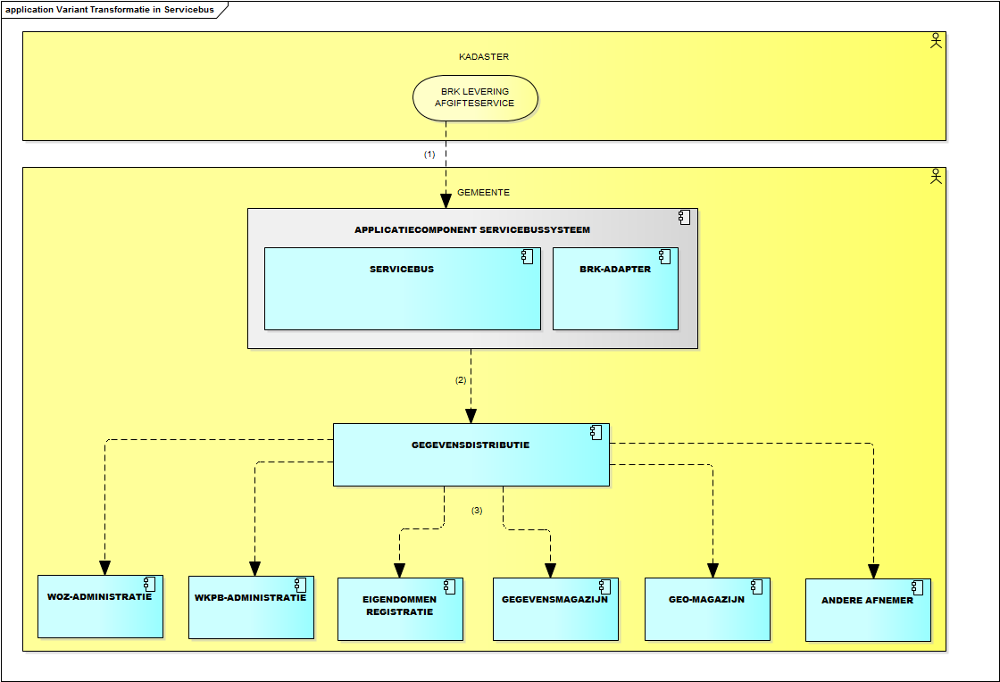
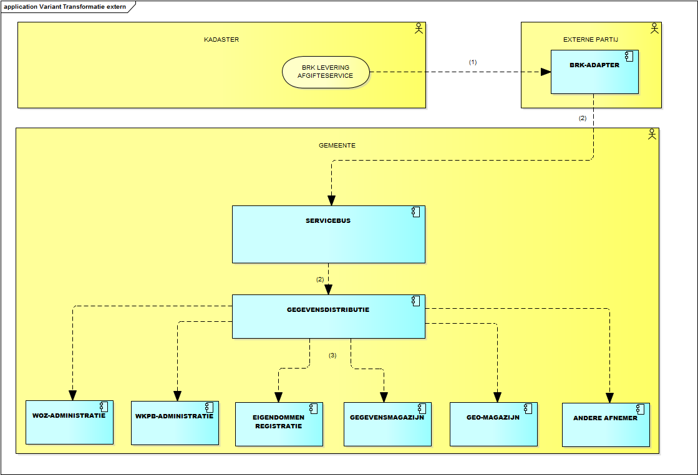
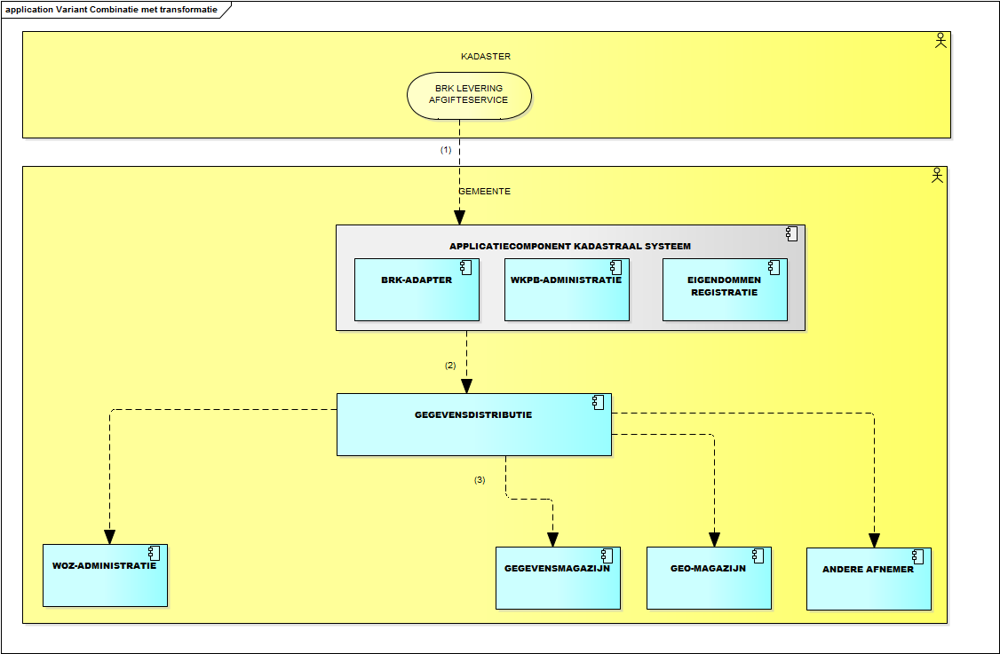

# Techniek StUF-koppelvlak Kadastrale mutatieservices

Bij gemeenten komen verschillende implementatievarianten van het GEMMA-applicatielandschap voor, elk met eigen voor- en nadelen. De gemeente wordt geacht om samen met de leveranciers het eigen applicatielandschap te beoordelen op de toepasbaarheid van het koppelvlak. Hiervoor onderkennen we vier implementatievarianten. Het verschil daartussen heeft betrekking op de wijze waarop invulling wordt gegeven aan de BRK-Adapter-functionaliteit (ophalen BRK-Levering-berichten uit de landelijke voorziening en vervolgens transformatie naar de Kadastrale mutatieservices).
Bij de implementatie van de verschillende varianten wordt gebruik gemaakt van softwarepakketten die door leveranciers worden aangeboden. Deze softwarepakketten implementeren functionaliteit van één of meerdere GEMMA-referentiecomponenten. Zo is het mogelijk dat een leverancier de functionaliteit van de referentiecomponenten ‘BRK-Adapter’ en ‘Wkpb-administratie’ in één fysiek softwarepakket levert. Dergelijke softwarepakketten noemen we in het vervolg van dit document ‘Applicatiecomponenten’.

## Basisvariant
Dit betreft de combinatie van applicatiecomponenten overeenkomstig de referentie-applicatiearchitectuur. De pijlen tussen de componenten zijn ‘flows’ oftewel gegevensstromen. Hiermee wordt de uitwisseling van gegevens weergegeven.
Het Kadaster biedt de mogelijkheid (service) om bij haar afgifteservice kadastrale mutaties in de vorm van BRK-Levering-berichten op te halen. Bij het doorsturen van de, door de gemeente, opgehaalde BRK-Levering-berichten (vanuit de BRK) zijn twee referentiecomponenten betrokken:
- BRK-Adapter en
- Gegevensdistributie.

Beide referentiecomponenten bieden specifieke functionaliteiten die van belang zijn voor het doorsturen naar de componenten waarin de BRK-mutaties uiteindelijk verwerkt worden. De BRK-Adapter ondersteunt het ophalen van BRK-Levering-berichten, de transformatie daarvan naar Kadastrale mutatieservices-berichten en de verstrekking daarvan aan Gegevensdistribtie en Gegevensdistributie ondersteunt de distributie van deze berichten (al dan niet aangepast v.w.b. waarden van elementen) naar afnemers. De Servicebus is niet in de referentie-architectuur opgenomen maar kan desgewenst ingezet worden voor de binnengemeentelijke routering van de Kadastrale mutatieservices-berichten (van de BRK-Adapter) naar Gegevensdistributie.

## Transformatie in de servicebus
In deze variant heeft de gemeente de transformatiefunctionaliteit ondergebracht in de servicebus-applicatie cq. zijn de Servicebus en de BRK-Adapter gecombineerd in één applicatiecomponent. Deze component verzorgt het ophalen van de BRK-leveringen via de service die het Kadaster daartoe biedt, het vertalen van de BRK-leveringen naar de Kadastrale mutatieservices en het routeren van deze services naar Gegevensdistributie.

## Transformatie extern
In deze variant heeft de gemeente de transformatiefunctionaliteit (BRK-Adapter) ondergebracht bij een externe partij. Deze partij onderhoudt de communicatie met de leveringfunctie van het Kadaster, ‘haalt de BRK-Levering-berichten op’, transformeert deze naar de Kadastrale mutatieservices en levert deze aan de gemeente waar ze door de Servicebus verwerkt worden (aangezien de services van buiten de gemeente komen).

## Transformatie gecombineerd
In deze variant heeft de gemeente de transformatiefunctionaliteit tezamen met de functionaliteit voor het beheer van de Wkpb en/of de Eigendommenadministratie ondergebracht in één applicatiecomponent ‘Kadastraal systeem’. Anders gezegd, de referentiecomponenten BRK-Adapter en Wkpb-administratie en/of Eigendommenadministratie zijn gecombineerd in één applicatiecomponent. Deze component verzorgt het ophalen van de BRK-leveringen via de service die het Kadaster daartoe biedt, het vertalen van de BRK-leveringen naar De Kadastrale mutatieservices, het routeren van deze services naar de Servicebus en ondersteunt het Wkpb- en/of eigendommenbeheer.

