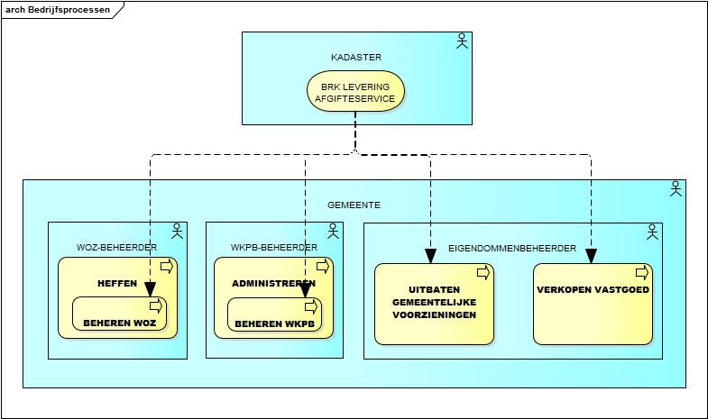

# StUF-koppelvlak Kadastrale mutatieservices

**Actuele versie:** 1.0.0  
**Beheerder:**  VNG Realisatie 

Actuele kadastrale gegevens zijn essentieel voor meerdere gemeentelijke taken. 
Tot 1 januari 2016 leverde het Kadaster de kadastrale mutaties nog in MO-AKR- en LKI-formaat ('alfanumeriek' resp. 'grafisch') maar vanaf die datum worden de mutaties alleen nog in het op de [BRK afgestemde formaat](http://www.kadaster.nl/web/Themas/Registraties/BRK/BRK-Leveringartikelen/BRK-Levering-vervangt-Massale-output.htm) (BRK Levering) geleverd. 

## Inleiding
Conform GEMMA vindt de binnengemeentelijke distributie van mutaties op basis- en kerngegevens plaats door middel van StUF-BG. Om hierin ook te kunnen voorzien voor kadastrale mutaties zoals opgenomen in de BRK Levering, heeft VNG Realisatie het Koppelvlak Kadastrale Mutatieservices ontwikkeld. Het specificeert een set van standaardservices waarmee de kadastrale mutaties, die het Kadaster in de vorm van de BRK-levering verstrekt, op basis van StUF-BG 3.10 gedistribueerd en verwerkt kunnen worden. De te distribueren gegevens zijn beschreven in versie 2 van het Referentiemodel Stelsel van Gemeentelijke Basisgegevens (RSGB).

Verschillende ontwikkelingen maken het vernieuwen van standaarden noodzakelijk om invulling te (blijven) geven aan de behoefte en wensen van gemeenten. De doorontwikkeling van de StUF standaard, de StUF sectormodellen en de StUF koppelvlakken is daarom stopgezet. Alleen wetswijzigingen, wijzigingen in de Logische Ontwerpen van Basisregistraties en gevonden fouten kunnen aanleiding zijn voor het publiceren van een nieuwe versie van deze standaarden. Zo wordt er voor gezorgd dat gemeenten hun werk kunnen blijven doen. Een toelichting op het vernieuwen van de standaarden is te vinden bij API-standaarden.

## Processen
Het koppelvlak ondersteunt interacties tussen enerzijds het verstrekken door het Kadaster van de BRK Levering en anderzijds het verwerken van kadastrale mutaties bij enkele gemeentelijke bedrijfsprocessen. Dit betreffen vooral het voeren van het WOZ-beheer, het Wkpb-beheer en het beheer van de eigendommenadministratie. Andere betrokken bedrijfsprocessen kunnen zijn Vergunningen en ontheffingen, Grond aankopen, Opstellen bestemmingsplan, Toezicht houden en Sanctie opleggen. De verstrekking van de BRK Levering beïnvloedt de bedrijfsprocessen ieder voor zich. Er is hierbij niet sprake van onderlinge afhankelijkheid van die bedrijfsprocessen. De samenhang is aldus beperkt tot interacties tussen enerzijds de verstrekking van de BRK Levering en anderzijds individuele bedrijfsprocessen. We visualiseren dit in onderstaande figuur v.w.b. de meest relevante bedrijfsprocessen.

## Referentiecomponenten
Het koppelvlak is van toepassing op referentiecomponenten voor het ontsluiten van basisgegevens (mid-office; ‘gegevensmagazijn’ en ‘geo-magazijn), het beheren van de WOZ-, Wkpb- en eigendommenadministratie (back-office) en eventuele andere referentiecomponenten waarvoor kadastrale mutaties relevant zijn. Dit betreffen:
- WOZ-administratie, WOZ-taxatiesysteem en Belastingensysteem,
- Wkpb-administratie,
- Eigendommenadministratie, Grondexploitatiebeheer,
- Ruimtelijke plannen administratie,
- Vergunningen, Handhaving,
- Gegevensmagazijn, Geo-magazijn,
- Gegevensdistributie, Servicebus en BRK-adaptersysteem.

De referentiecomponent 'BRK-adapter' speelt een esentiele rol in de toepassing van het koppelvlak: het vertaalt de BRK Levering naar de kadastrale mutatieservices in StUF.
Zie voor de onderlinge afhankelijkheden van de referentiecomponenten onder 'Techniek'.

## Gebeurtenissen
BRK-Levering biedt met haar mutaties registratiegebonden gebeurtenissen: er is een kadastraal object toegevoegd, gewijzigd of vervallen; er is een wijziging doorgevoerd in de zakelijke rechten op een kadastraal object, et cetera. Relevanter voor de genoemde gemeentelijke bedrijfsprocessen zijn de gebeurtenissen in de ‘reële wereld’ die hebben geleid tot deze mutaties, zoals verkoop van een perceel. Deze gebeurtenissen zijn tot op zekere hoogte af te leiden uit de ontvangen mutaties. Het koppelvlak onderscheidt de hierna volgende gebeurtenissen. Mutaties op kadastrale objecten die gekenmerkt zijn met dezelfde stuk-aanduiding (ter inschrijving aangeboden stuk) vormen tezamen de in een gebeurtenis betrokken mutaties.

Gebeurtenissen waarbij sprake is van het overgaan van kadastrale objecten in andere kadastrale objecten (twee of meer betrokken kadastrale objecten):
- Splitsing kadastraal object: splitsing van een (oud) kadastraal object in twee of meer nieuwe kadastrale objecten;
- Samenvoeging kadastrale objecten: samenvoeging van twee of meer (oude) kadastrale objecten tot één nieuw kadastraal object;
- Samenvoeging en splitsing van kadastrale objecten: gelijktijdige overgang van twee of meer (oude) kadastrale objecten en twee of meer nieuwe kadastrale objecten;
- Herstel moeder kadastraal object: ongedaan maken van een eerdere splitsing kadastraal object;
- Hernoemen kadastraal object: overgang van een (oud) kadastraal object in een nieuw kadastraal object;
- Vormen appartementsrechtbasis: vormen appartementscomplex n.a.v. appartementsrechtssplitsing.

Gebeurtenissen waarbij geen sprake is van het overgaan van kadastrale objecten (één of meer betrokken kadastrale objecten):
- Ontstaan kadastraal object: ontstaan van één of meer nieuwe kadastrale objecten terwijl er geen (te beëindigen) oud kadastraal object is cq, oude kadastrale objecten zijn vermeld waarin de nieuwe kadastrale objecten zijn overgegaan (uitzonderingsgeval);
- Beeindiging kadastraal object: beindiging van één of meer kadastrale objecten terwijl er geen nieuw kadastraal object is cq, nieuwe kadastrale objecten zijn vermeld waarin de kadastrale objecten zijn overgegaan (uitzonderingsgeval);
- Wijziging (zakelijk) recht: wijziging in alleen de (zakelijke) rechten, zakelijk rechtgegevens, bijbehorende aantekeningen en/of bijbehorende personen van één of meer kadastraal objecten;
- Wijziging aantekening: wijziging in alleen de aantekeningen van één of meer kadastrale objecten;
- Wijziging kadastraal objectgegevens: wijziging van alleen de gegevens van het kadastraal object zelf of van de kadastrale objecten zelf;
- Wijziging kadastraal object: wijziging van twee of meer groepen van gegevens (kadastraal objectgegevens, zakelijke rechten met bijbehorende aantekeningen, kadastraal object aantekeningen) van één of meer kadastrale objecten.

## Actuele versie
De actuele versie van het koppelvlak is de 1.0-versie. Deze is op 1 juni 2016, na openbare consultatie, door de Regiegroep Gegevens- en Berichtenstandaarden vastgesteld. Deze versie is door VNG Realisatie ontwikkeld onder begeleiding van twee werkgroepen: een werkgroep van gemeenten en één van de leveranciers. Als gemeentelijke werkgroep fungeerde de Expertgroep BRK van het [Gemeentelijk Geo-Beraad](http://dataland.nl/onze-diensten/gemeentelijk-geo-beraad/).
De koppelvlakspecificatie en de berichtschema’s treft u aan onder 'Documentatie'.

## Afleiding
De actuele versie (1.0) is afgeleid van StUF-BG 3.10 en daarmee van versie 2 van het RSGB dat op haar beurt afgeleid is van de AKR, de voorgaande structuur van de kadastrale registratie bij het Kadaster. Dat betekent dat de BRK-Levering wordt 'terugvertaald' naar StUF-BG 3.10 cq. RSGB 2 oftewel dat de actuele versie van het koppelvlak gericht is op de (MO-)AKR-structuur.

## Discussieplatform
Hier kunt u terecht voor de nieuwste discussies m.b.t. [StUF-koppelvlak Kadastrale Mutatieservices](https://github.com/VNG-Realisatie/StUF-Standaarden/labels/Koppelvlak%20-%20KMS).
